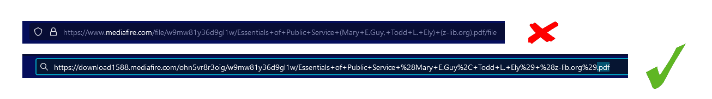
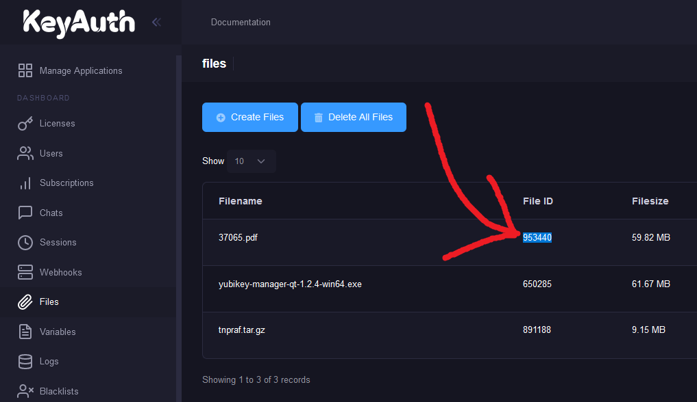

# Files

First, upload your URL to a file host. You could use [Discord](https://discord.com), make your own CDN using [Netlify](https://www.netlify.com/) or [GitHub pages](https://docs.github.com/en/pages/getting-started-with-github-pages/creating-a-github-pages-site) so the URL stays the same and the file just changes when you upload new one. Other uploaders include [https://pomf.cat](https://pomf.cat) and [https://catbox.moe](https://catbox.moe)

Now, copy the direct download link. This should include the file extension (`.exe`, `.sys`, `.dll`) at the end of the URL. Paste this URL in your web browser. Make sure that it downloads immediately without you needing to click a button or anything. If you need to click a button or something to download, then it’s the **wrong URL** and will **NOT work**.

<figure><figcaption></figcaption></figure>

Navigate to [https://keyauth.cc/app/?page=files](https://keyauth.cc/app/?page=files) and click the **Upload File** button. Paste the direct download link in the URL field and then press the Submit button.

<figure><figcaption></figcaption></figure>

You will then be displayed a **File ID**, copy this ID and use while invoking the download function in your loader. Here’s a C# code snippet.

<figure><figcaption></figcaption></figure>


```csharp
byte[] result = KeyAuthApp.download("953440");
if (!KeyAuthApp.response.success)
{
    Console.WriteLine("\n Status: " + KeyAuthApp.response.message);
    Thread.Sleep(1500);
    Environment.Exit(0);
}
else
    File.WriteAllBytes(Directory.GetCurrentDirectory() + "\\37065.pdf", result);
```


The download function returns the bytes of the file. You may utilize these bytes however you’d like. In the code snippet, the bytes are used to write a file to disk. However if you want to make it very difficult for a user to obtain the file being downloaded, you’ll want to keep the bytes in memory and execute the file without writing it to disk. You can find plenty examples of this online on [GitHub](https://github.com/) with the search queries ["RunPE"](https://github.com/search?q=runpe) and ["injector bytes"](https://github.com/search?q=injector+bytes)
